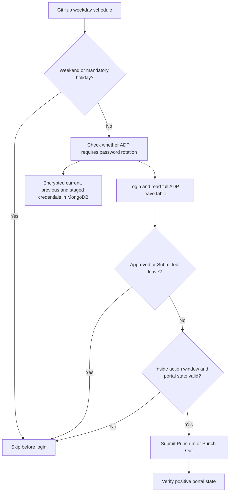

# ADP SecurTime attendance automation

Fail-closed Punch In and Punch Out automation for one authorized ADP SecurTime account. GitHub Actions runs the browser jobs, MongoDB stores encrypted credentials and run state, and all scheduling decisions use `Asia/Kolkata`.

## Current production behavior

| Capability         | Behavior                                                                                                  |
| ------------------ | --------------------------------------------------------------------------------------------------------- |
| Punch In           | Weekdays at 09:00 IST, within the configured grace window                                                 |
| Punch Out          | Weekdays at 18:00 IST, within the configured grace window                                                 |
| Weekends           | Skipped before opening the portal                                                                         |
| Mandatory holidays | Skipped from the `MANUAL_HOLIDAYS` repository variable                                                    |
| Optional holidays  | Treated as workdays unless covered by leave                                                               |
| Leave              | ADP's full leave table is checked live; `Approved` and `Submitted` block attendance, `Withdrawn` does not |
| Password expiry    | Rotated only when ADP presents the forced change-password screen                                          |
| Failure handling   | Unknown calendar, credential, location, selector, or portal state blocks the punch                        |

The current tenant's Punch In, Punch Out, Hyderabad geolocation, full leave-table flow, password rotation, fresh-password verification, and MongoDB credential promotion were validated live on 2026-07-22.

## Execution flow



## Local commands

On Windows PowerShell, use `npm.cmd` if the execution policy blocks `npm.ps1`.

```powershell
npm.cmd ci
npm.cmd run validate
npm.cmd run credential:status
npm.cmd run credential:verify
npm.cmd run credential:copy
npm.cmd run dashboard
```

`credential:copy` places the current portal password on the clipboard and clears it after 30 seconds. `credential:show -- --confirm` exists for explicit recovery use but prints the password to the terminal.

## Documentation

- [SETUP.md](SETUP.md): complete first-time setup and production activation.
- [RECOVERY.md](RECOVERY.md): incident and credential-recovery procedures.
- [SECURITY.md](SECURITY.md): trust boundaries, secret handling, and residual risks.
- [.agent/README.md](.agent/README.md): context and guardrails for future coding agents.

## Repository layout

- `.github/workflows/`: production schedules and confirmed manual operations.
- `src/automation/attendance/`: calendar, time-window, idempotency, and punch decisions.
- `src/automation/passwordRotation/`: forced-change detection and two-phase credential rotation.
- `src/automation/portal/`: verified ADP selectors, Shadow DOM helpers, login, leave, and punch flows.
- `src/repositories/`: encrypted credentials, locks, run records, and rotation history.
- `src/cli/`: database initialization and local credential tooling.
- `tests/` and `fixtures/`: deterministic safety and browser fixtures.

## Production safeguards

- Repository permissions are read-only inside workflows.
- MongoDB locks and unique idempotency keys prevent duplicate submissions.
- Credentials use AES-256-GCM; the encryption key is never stored in MongoDB.
- A replacement password is staged encrypted before portal submission and promoted only after a fresh login succeeds.
- CAPTCHA, OTP, MFA, security-question, and unknown-device states require manual intervention.
- Failure screenshots and metadata are sanitized and retained for seven days.
- The local dashboard binds only to `127.0.0.1`.
- An external inactivity watcher is required because a repository workflow cannot re-enable itself after GitHub disables scheduled workflows for inactivity.

This project must only be used for an account and attendance policy the operator is authorized to automate.
