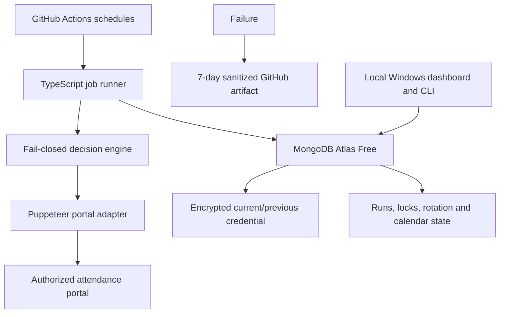

# ADP attendance automation

Fail-closed attendance automation for one authorized ADP SecurTime account. Scheduled work runs on GitHub-hosted runners; encrypted state, locks, and run history live in MongoDB Atlas. The dashboard and credential tools run locally on Windows.

> **Production attendance is enabled.** Punch In and Punch Out, IST browser time, Hyderabad location, positive portal-state verification, and on-demand password rotation were validated live on 2026-07-22.

## Architecture



The decision engine requires positive evidence for authentication, workday status, current attendance state, time window, credential consistency, selector validation, and lock ownership. An unknown state causes no attendance submission.

## Commands

```powershell
npm ci
npm run validate
npm run db:init
npm run credential:seed
npm run credential:status
npm run credential:copy
npm run credential:show -- --confirm
npm run credential:verify
npm run dashboard
```

The dashboard binds only to `127.0.0.1`. The credential CLI shows metadata by default, disables secret access in CI, audits copy/show operations, and clears an unchanged clipboard after 30 seconds.

## Workflows

- `attendance-in.yml`: 03:30 UTC / 09:00 IST, weekdays.
- `attendance-out.yml`: 12:30 UTC / 18:00 IST, weekdays.
- `manual-automation.yml`: diagnostics and explicitly confirmed actions.

Scheduled jobs use `npm ci`, read-only repository permission, ten-minute timeouts, concurrency guards, MongoDB locks, and failure-only artifacts. GitHub schedules can be delayed, so application time windows remain authoritative.

## Safety model

- Exact coordinates are required through protected environment values and never logged.
- Passwords are encrypted with versioned AES-256-GCM payloads and a key that is not stored in MongoDB.
- A generated password is staged encrypted before portal submission, verified in a fresh browser session, and only then promoted to the current credential. Only current and previous credentials remain after completion.
- Weekend and configured mandatory-holiday checks run before opening the portal.
- Live ADP leave requests block attendance when the current date is covered by an `Approved` or `Submitted` request; `Withdrawn` requests do not block.
- Optional holidays are treated as workdays unless a leave request covers the date.
- CAPTCHA, MFA, OTP, email verification, and unknown-device challenges stop the run.
- The system does not bypass portal security controls.
- Each production attendance run checks for ADP's forced password-change screen. Rotation happens only when ADP requires it; normal logins do not change the password.
- Screenshots blur form, employee, profile, and location elements before capture.

See [SECURITY.md](SECURITY.md) for the threat model and [RECOVERY.md](RECOVERY.md) for failure procedures.

## Free usage estimate

There are about 44 normal scheduled runs in a 22-workday month. At a measured target of 2–4 minutes per run, expected use is approximately 88–176 GitHub-hosted runner minutes per month, plus limited manual diagnostics. The project contains no hourly monitor, hosted dashboard, fake keepalive commit, or paid infrastructure.
